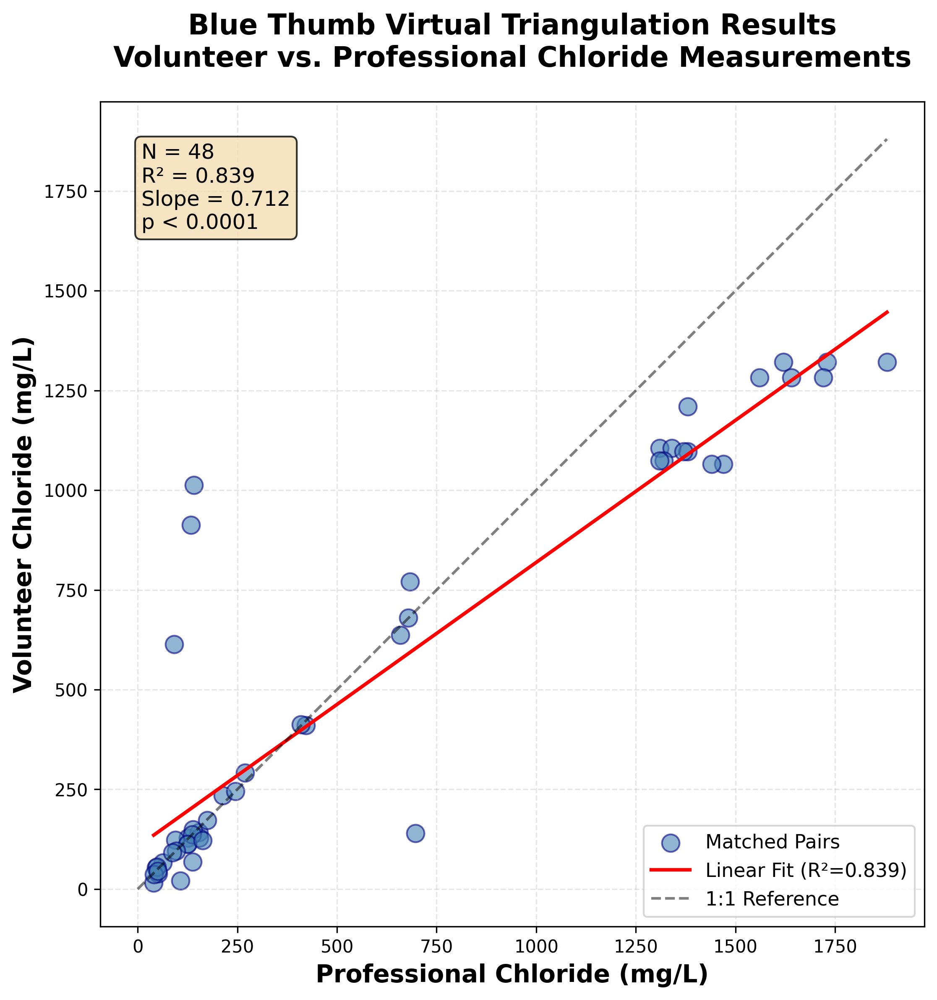

# Blue Thumb Chloride Validation Pipeline

> **Principal Investigator:** Miguel Ingram (Black Box Research Labs)
> **Institutional Partner:** Oklahoma Conservation Commission (OCC)

Validation of Oklahoma Blue Thumb citizen science chloride data against professional monitoring data from the EPA Water Quality Portal, using spatial-temporal matching ("virtual triangulation").

 

---

## Results

| Metric | Vol-to-Pro (Phase 2) | Pro-to-Pro (Baseline) |
|:---|:---|:---|
| **Sample Size** | N = 25 | N = 42 |
| **R²** | 0.607 (p < 0.0001) | 0.753 (p < 0.0001) |
| **Slope** | 0.813 | 0.735 |
| **Unique Test Sites** | 4 | 15 |
| **Matching Window** | 125 m / 72 h | 125 m / 72 h |

**Interpretation:** Blue Thumb volunteers capture ~81% of the professional chloride signal using field titration kits. The systematic offset is consistent with the methodological difference between Silver Nitrate Titration (volunteer) and professional laboratory methods.

> **Method verification pending:** OKWRB uses EPA 325.2 (Automated Colorimetry) per WQP metadata. CNENVSER's analytical method is unrecorded in WQP (72% of vol-to-pro matches). See `docs/Volunteer_Chloride_Validation_METHODS.md`.



---

## Quick Start

```bash
git clone https://github.com/ImmortalDemonGod/bluestream-test.git
cd bluestream-test
python -m venv venv
source venv/bin/activate
pip install -r requirements.txt

# Run full pipeline
python -m src.pipeline                   # Full run (downloads EPA data)
python -m src.pipeline --skip-extract    # Uses cached EPA data

# Or step-by-step
python -m src.extract       # Download from EPA WQP (~5-10 min)
python -m src.transform     # Clean, separate, load Blue Thumb CSV (~2 min)
python -m src.analysis      # Dual matching: pro-to-pro + vol-to-pro (<1 min)
python -m src.visualize     # Generate validation plot (<1 min)

# Verify
pytest tests/test_pipeline.py -v
```

---

## Data Sources

| Source | Type | Access |
|:---|:---|:---|
| **EPA Water Quality Portal** | Professional chloride measurements | Public API (`waterqualitydata.us`) |
| **Blue Thumb CSV** | Volunteer chloride measurements | [OCC R-Shiny app](https://occwaterquality.shinyapps.io/OCC-app23a/) (SHA-256 verified at runtime) |

### Professional Organizations in Matched Pairs

- **CNENVSER** (Chickasaw Nation Environmental Services): 18 of 25 vol-to-pro matches — method unrecorded in WQP
- **OKWRB-STREAMS_WQX** (Oklahoma Water Resources Board): 7 of 25 vol-to-pro matches — EPA 325.2

---

## Methodology

**Virtual Triangulation** matches volunteer and professional measurements using:
1. **Spatial proximity:** ≤ 125 meters (Haversine great-circle distance, `scipy.spatial.cKDTree`)
2. **Temporal proximity:** ≤ 72 hours (absolute time difference)
3. **Strategy:** Closest spatial match per volunteer measurement
4. **Concentration filter:** Professional values > 25 mg/L (chloride)

Two comparisons run with identical parameters:
- **Vol-to-Pro:** Blue Thumb volunteers vs. professional reference (OKWRB, CNENVSER)
- **Pro-to-Pro:** OCC Rotating Basin (WQP `OKCONCOM_WQX`, Method 9056) vs. same professional reference

All parameters are in `config/config.yaml`. Full methods documentation: `docs/Volunteer_Chloride_Validation_METHODS.md`.

---

## Repository Structure

```
bluestream-test/
├── README.md
├── requirements.txt
├── config/
│   └── config.yaml            # All parameters (125m/72h/closest)
├── src/
│   ├── pipeline.py            # Single entry point
│   ├── extract.py             # EPA WQP download
│   ├── transform.py           # Data cleaning + Blue Thumb CSV override
│   ├── analysis.py            # cKDTree spatial-temporal matching
│   └── visualize.py           # Validation plot
├── tests/
│   └── test_pipeline.py       # 12 assertions (Phase 2 targets)
└── docs/
    ├── Volunteer_Chloride_Validation_METHODS.md
    ├── BUILD_GUIDE.md
    └── TEACHER_VERSION_BLUETHUMB_ETL_BUILD_GUIDE.md
```

Pipeline outputs (gitignored, regenerated by `python -m src.pipeline`):
- `data/outputs/matched_pairs.csv` — Vol-to-pro matches (N=25)
- `data/outputs/matched_pairs_pro_to_pro.csv` — Pro-to-pro baseline (N=42)
- `data/outputs/summary_statistics_*.txt` — Per-org breakdown with method provenance
- `data/outputs/metadata.json` — Reproducibility manifest (git commit, config hash, CSV hash)
- `data/outputs/validation_plot.png` — Committed to repo for reference

---

## Phase 1 History

An initial analysis (N=48, R²=0.839, 100m/48h/all) was completed in January 2026 using `OKCONCOM_WQX` data from the EPA WQP as "volunteer" data. On Jan 21, 2026, OCC's Kim Shaw clarified that `OKCONCOM_WQX` contains OCC Rotating Basin professional data (Method 9056), not Blue Thumb volunteers. Phase 2 corrects this by sourcing actual volunteer data from a separate Blue Thumb CSV export, verified against OCC's ArcGIS FeatureServer.

The Phase 1 results are preserved in git history. The Rotating Basin data is now used as a pro-to-pro baseline comparison.

---

## License

MIT License — See `LICENSE` file
